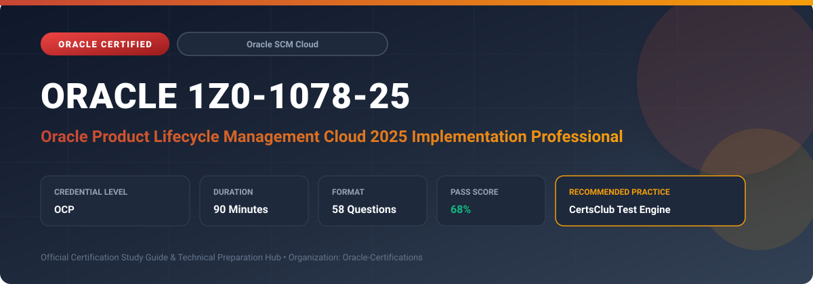

  

# Oracle 1Z0-1078-25: Oracle Product Lifecycle Management Cloud 2025 Implementation Professional

---

## 1. Exam Overview & Candidate Profile

The **Oracle 1Z0-1078-25: Oracle Product Lifecycle Management Cloud 2025 Implementation Professional** examination is engineered for enterprise architects, solution specialists, functional consultants, and implementation professionals seeking formal industry recognition of their proficiency in Oracle technologies.

The Oracle Product Lifecycle Management Cloud 2025 Implementation Professional (1Z0-1078-25) certification demonstrates mastery in configuring Oracle Product Hub and Product Development Cloud. Candidates validate proficiency in establishing item catalogs, item attribute groups, change orders, engineering change workflows, revision controls, item rules, and product commercialization.

### Target Audience & Prerequisites
- **Target Roles**: Implementation Specialists, Cloud Architects, Technical Leads, Enterprise Functional Consultants, and Systems Engineers.
- **Recommended Experience**: 1–2 years of practical, hands-on experience designing, implementing, and maintaining corresponding Oracle Cloud solutions.
- **Credential Earned**: Oracle Certified Professional (OCP).

---

## 2. Key Exam Specifications

| Specification | Details |
| :--- | :--- |
| **Exam Code** | **Oracle 1Z0-1078-25** |
| **Official Title** | Oracle Product Lifecycle Management Cloud 2025 Implementation Professional |
| **Certification Track** | Oracle Supply Chain Management Cloud |
| **Exam Duration** | 90 Minutes |
| **Number of Questions** | 58 Questions |
| **Passing Score** | 68% |
| **Question Format** | Multiple Choice (Single/Multiple Answer), Scenario-Based Questions |
| **Delivery Provider** | Oracle University / Pearson VUE (Online Proctored or Test Center) |
| **Recommended Practice Engine** | [CertsClub Oracle Practice Tests](https://www.certsclub.com/oracle/1z0-1078-25-dumps.html) |

---

## 3. Official Blueprint & Exam Domain Breakdown

The examination assesses candidate competencies across core functional domains weighted as follows:

| Domain Area | Weighting |
| :--- | :--- |
| **Product Master Data Management & Item Class Setup** | `25%` |
| **Product Development & Engineering Change Orders** | `25%` |
| **Structures, Packs, Components & Commercialization** | `20%` |
| **Item Rules, Data Quality & Governance Policies** | `15%` |
| **Item Import, Publication & Spoke System Integration** | `15%` |

---

## 4. Deep Dive into Complex & Challenging Technical Topics

To secure a passing score on the 1Z0-1078-25 exam, candidates must master the following advanced concepts:

- Configuring Item Classes, extensible flexfield (EFF) attribute groups, user-defined attributes, and lifecycle phases.
- Managing Engineering Change Orders (ECO), Change Types, workflow status progressions, and impact analysis.
- Constructing Item Structures (Bills of Material), multi-level parent-child assemblies, and packaging hierarchies.
- Writing and tuning Item Rules for automated attribute validation, default values, and rule set execution.

---

## 5. Scenario-Based Demo & Practice Questions

### Question 1
An enterprise wants to enforce a rule where whenever an item's 'Hazardous' attribute is set to Yes, the 'Storage Temperature' attribute becomes mandatory. Which Oracle Product Hub feature enforces this requirement?

A) Lifecycle Phase Security
B) Item Rule Definition with Validation and Requirement Logic
C) Change Order Workflow Route
D) Spoke System Mapping

- **Correct Answer**: `B) Item Rule Definition with Validation and Requirement Logic`  
- **Technical Explanation**: Item Rules in Oracle Product Hub enable declarative conditional logic to validate data, enforce required attributes based on user input, and set default values across item classes.

---

### Question 2
Which change entity in Oracle Product Development Cloud allows cross-functional review, redlining of bill of materials, and revision level incrementing for commercial items?

A) Engineering Change Order (ECO)
B) Sourcing Rule Definition
C) Catalog Publication Request
D) Descriptive Flexfield Mapping

- **Correct Answer**: `A) Engineering Change Order (ECO)`  
- **Technical Explanation**: Engineering Change Orders (ECOs) govern formal modifications to items and item structures, providing redlining capabilities, workflow approvals, effective dates, and automated revision updates.

---

## 6. Recommended Preparation Strategy & Practice Testing Engine

Achieving certification in **Oracle 1Z0-1078-25** requires balanced theoretical study and scenario-based simulation practice:

1. **Review Oracle Documentation**: Master architecture guides, implementation workbooks, and administration manuals on the Oracle Help Center.
2. **Hands-on Lab Practice**: Execute real-world configuration, policy setup, and troubleshooting tasks in your cloud tenancy or test instance.
3. **Simulated Exam Drills**: Practice answering timed, scenario-based multiple-choice questions to familiarize yourself with the question formats, traps, and timing constraints.

### Practice With CertsClub
For realistic practice questions, updated dumps, and mock testing environments:
- **Resource**: [CertsClub Oracle Practice Test Engine](https://www.certsclub.com/oracle/1z0-1078-25-dumps.html)
- **Special Discount**: Use coupon code **`club20`** during checkout for an instant **20% discount** on all practice exam bundles and testing engines.

---

## 7. Official Documentation & References

- [Oracle University Certification Registry](https://education.oracle.com/)
- [Oracle Help Center Documentation Portal](https://docs.oracle.com/)
- [Oracle Cloud Infrastructure & Applications Guides](https://docs.oracle.com/en/cloud/)
- [CertsClub Oracle Certification Exam Practice](https://www.certsclub.com/oracle/1z0-1078-25-dumps.html)

---

## 8. SEO & Discovery Keywords

`oracle 1z0-1078-25, oracle 1z0-1078-25 exam, oracle 1z0-1078-25 dumps, 1Z0-1078-25 practice questions, 1Z0-1078-25 study guide, oracle 1z0-1078-25 syllabus, oracle product lifecycle management cloud 2025 implementation professional, certsclub 1z0-1078-25`
